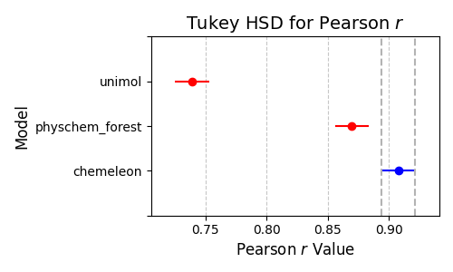
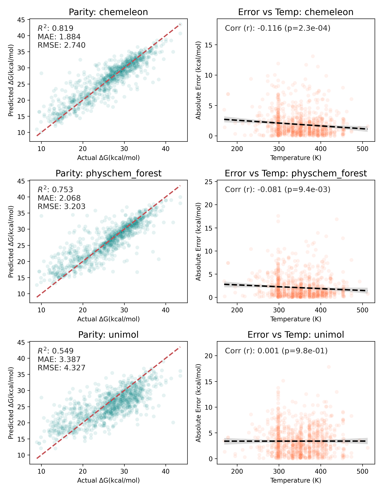
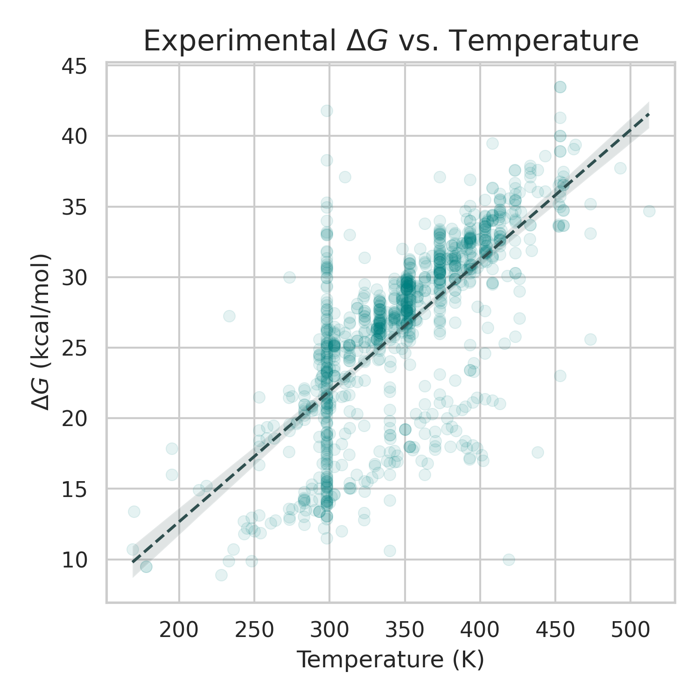

# `chemeleon_atropisomers`

Comparing [`CheMeleon`](https://arxiv.org/abs/2506.15792), [Physicochemical Random Forest](https://github.com/basf/MolPipeline/blob/4caf00f6c530b5cd92b34501ea2bcfd172b7412b/molpipeline/predefined_pipelines/baselines.py#L160), and [UniMol2](https://arxiv.org/abs/2406.14969) for atropisomer rotational barrier detection, dataset from [_Physicochemically Informed Axial Chirality Descriptors Enable Accurate Prediction of Atropisomeric Stability_](https://doi.org/10.1002/anie.202521349).

## Usage

This work is based on the dataset described in: 10.1002/anie.202521349 - this dataset is **not publicly distributed**; to run this code, reach out to the original authors and request a copy of it.
The _code_ in this repository is permissively licensed (see [LICENSE](./LICENSE)) under the MIT license.

From there, to get the code up and running you just need the following dependencies:
`pip install chemprop 'pandas<3' molpipeline scikit-learn unimol_tools huggingface_hub`

If you want to run only one model, you can just install:
 - CheMeleon: `chemprop 'pandas<3'` (the `pandas` limitation is because of a bug in Chemprop being fixed [here](https://github.com/chemprop/chemprop/pull/1350))
 - UniMol: `unimol_tools huggingface_hub`
 - MolPipeline: `molpipeline`

For the other plotting and splitting code, you need: `scikit-learn pandas matplotlib seaborn numpy scipy statsmodels`.

Each toolkit (CheMeleon, MolPipeline, UniMol2) has a separate script in its own directory.
You can run each model by navigating to that directory and executing the corresponding shell script or Python file.

## Results

Across the 5 replicates of 5-fold cross validation, the three tested models are separable and place in this order:

 1. `CheMeleon`: average pearson r of 0.91
 2. Physchem Forest: 0.87 pearson r, and at $\alpha = 0.05$ statistically worse than `CheMeleon`
 3. UniMol2: 0.74 pearson r, worse than both `CheMeleon` and Physchem Forest

You can see this visually below (2. and 3. are separable, the comparison is not shown):

We can also look at the actual parity plots and error distributions (versus temperature) for just the 1st (index 0) repetition to get a better idea of model performance:

All models seem to have a systematic overprediction in the low range of the target variable, though UniMol2 also has a systematic underprediction in the higher range.
`CheMeleon` and Physchem Forest both also learn the low temperature region more accurately than the high temperature region (i.e., these models have heteroskedastic error).
This is perhaps attributable to the construction of the data - molecules with a measurable rotational barrier at high temperature are likely to have a high rotational barrier, shrinking the target distribution and making it easier to learn.
You can see this in the below plot:

Above 400, nearly all of the datapoints are confined to a ~5 kcal/mol range.
